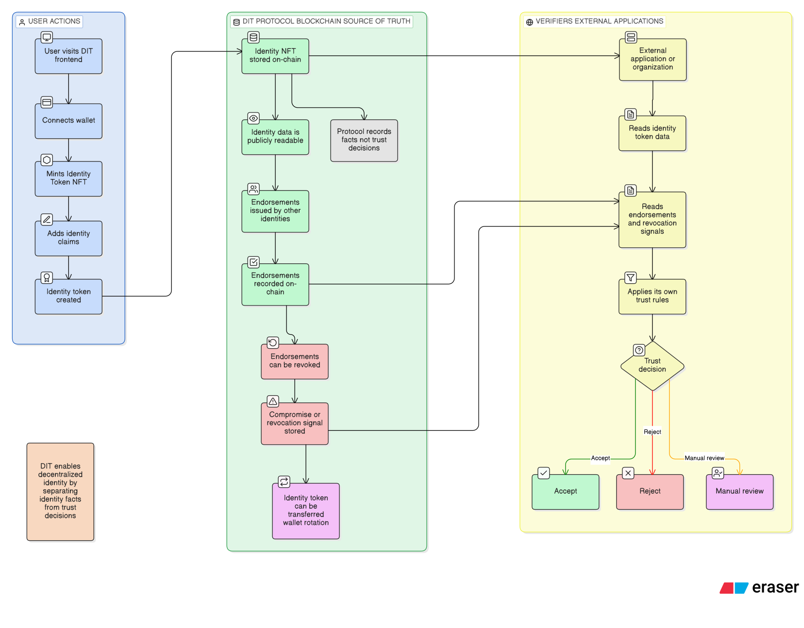

# Identity Tokens — Project Workflow

## Overview

- **Self-issued identity token minting:** Users create and mint their own identity tokens, optionally attaching metadata. No central issuer is required.

- **On-chain identity storage:** Identity tokens and their metadata are stored on-chain (e.g. as ERC-721 NFTs), providing a portable, verifiable record.

- **Endorsement by other identity holders:** Holders of identity tokens can endorse other identities on-chain, building a graph of attestations and trust.

- **Optional revocation:** Endorsements or credentials can support revocation (e.g. via a registry or expiry), so trust can be updated or withdrawn when needed.

- **Frontend reading on-chain data:** The frontend reads identity and endorsement data from the chain (e.g. via RPC and events) to display profiles, endorsements, and status.

- **External services verifying identity:** Third-party services can verify identity and endorsements by reading the same on-chain data, enabling use cases like access control or credential checks without relying on the frontend alone.
